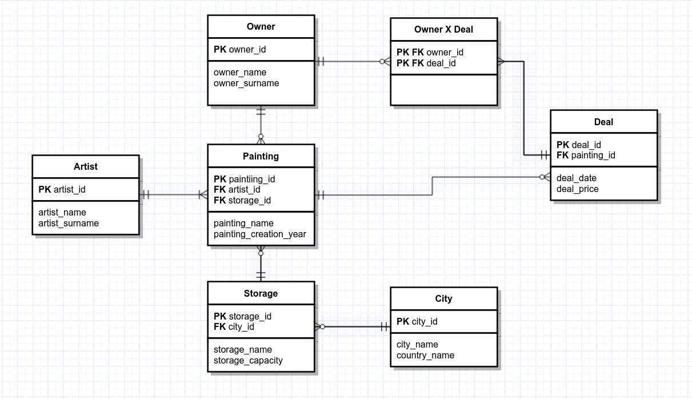

# 1

- Владелец - кто владеет картиной на данный момент
- Место хранения - где картина находится на данный момент(музей, специальное хранилище и т.д.)
- Город - местонахождение хранилища
- Сделка - покупка/продажа/унаследование/etc. картины 

**Картина** - версионная таблица, т. к. владелец и место хранения меняются

**Сделка** - таблица фактов

# 2

#### a. 

#### b. 

#### c.
| **Artist** |                |                          |          |                |
|------------|----------------|--------------------------|----------|----------------|
| **PK/FK**  | **Name**       | **Description**          | **Type** | **Constraint** |
| PK         | artist_id      | Индентификатор художника | INTEGER  | PRIMARY KEY    |
|            | artist_name    | Имя художника            | STRING   | NOT NULL       |
|            | artist_surname | Фамилия художника        | STRING   | NOT NULL       |

| **Painting** |               |                         |          |                                   |
|--------------|---------------|-------------------------|----------|-----------------------------------|
| **PK/FK**    | **Name**      | **Description**         | **Type** | **Constraint**                    |
| PK           | painting_id   | Индентификатор картины  | INTEGER  | PRIMARY KEY                       |
| FK           | artist_id     | Идентификатор художника | INTEGER  | FK references Artist(artist_id)   |
| FK           | storage_id    | Идентификатор хранилища | INTEGER  | FK references Storage(storage_id) |
|              | painting_name | Название картирны       | STRING   | NOT NULL                          |
|              | creation_date | Дата создания картины   | DATE     | CHECK(creation_date <= GETDATE()) |

| **Storage** |                  |                          |          |                             |
|-------------|------------------|--------------------------|----------|-----------------------------|
| **PK/FK**   | **Name**         | **Description**          | **Type** | **Constraint**              |
| PK          | storage_id       | Индентификатор хранилища | INTEGER  | PRIMARY KEY                 |
| FK          | city_id          | Идентификатор города     | INTEGER  | FK references City(city_id) |
|             | storage_name     | Название хранилища       | STRING   | NOT NULL                    |
|             | storage_capacity | Вместимость хранилища    | INTEGER  | СHECK(storage_capacity > 0) |

| **Owner** |                |                          |          |                |
|------------|----------------|--------------------------|----------|----------------|
| **PK/FK**  | **Name**       | **Description**          | **Type** | **Constraint** |
| PK         | owner_id      | Индентификатор владельца | INTEGER  | PRIMARY KEY    |
|            | owner_name    | Имя владельца          | STRING   | NOT NULL       |
|            | owner_surname | Фамилия владельца       | STRING   | NOT NULL       |

| **City** |                |                          |          |                |
|------------|----------------|--------------------------|----------|----------------|
| **PK/FK**  | **Name**       | **Description**          | **Type** | **Constraint** |
| PK         | city_id      | Индентификатор города | INTEGER  | PRIMARY KEY    |
|            | city_name    | Название города           | STRING   | NOT NULL       |
|            | country_name | Название страны        | STRING   | NOT NULL       |

